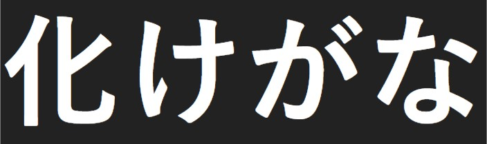
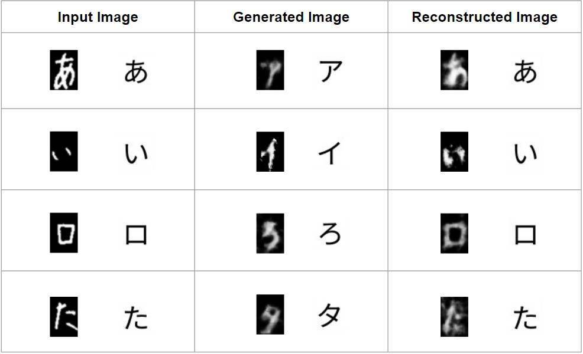

  

<h1> BAKEGANA: Japanese character translation from unpaired data </h1>

Using a dual learning framework to generate hiragana images from katakana, and katakana images from hiragana.

  

  

Read about this project on Medium: [LINK](https://alex-leung.medium.com/%E5%8C%96%E3%81%91%E3%81%8C%E3%81%AA-japanese-character-translation-from-unpaired-data-a972b0dfe3ea)
